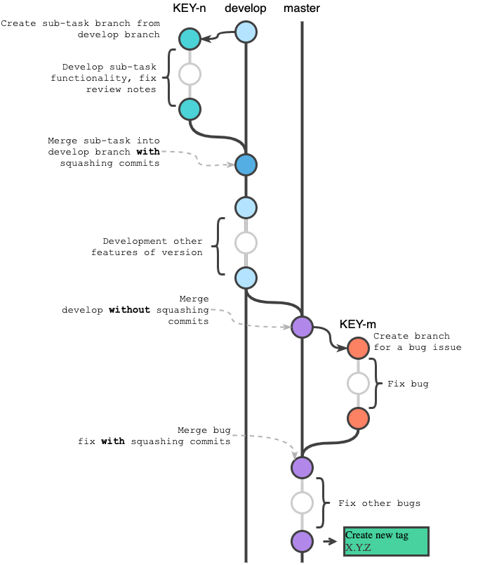

## Gitflow

## CI/CD Pipeline:

- Feature branch goes through an automatic stage of testing and auditing, after which it is deployed in a separate environment for test review
- After the Feature branch is merged into the Develop branch, the application goes through the Build and Deployment stages in the Develop environment
- When the version is ready, the application is merged into the Master branch, from where it is also Built and Deployed to the Master environment
- After the application is stabilized, a Tag of the corresponding version is created, which deployed into the Production environment
