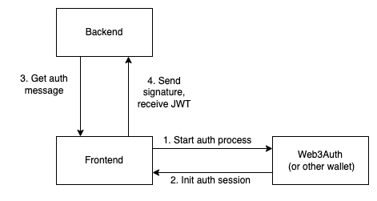
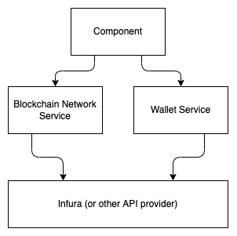

# Tech design for v0.3

## Global components and services

### Authorization



Authorization will involve 2 stages:

- Wallet Authorization
- Backend Authorization

#### Frontend

To connect a wallet on the client side, use the @web3auth/core library and related ones.
Authorization functionality should be implemented as a Context Wrapper, providing child components with the ability to interact with the wallet.
To communicate with the backend, use the SDK generated on the backend side, based on OpenAPI.

### Blockchain connection



Organize the frontend architecture in such a way that the system can support multiple connections at the same time. Separate the connection to the blockchain into a separate service, do not use the wallet service to communicate with the blockchain for general requests.

Thus, with an authorized wallet, the application will maintain 2 active network connections:
- Blockchain Network Service provides a connection to the blockchain without an authorized wallet (getting a block, balance, transaction history)
- Wallet Service provides a connection with authorization, providing the ability to sign transactions and sign messages. Wallet service can use the Blockchain Network Service if necessary (for example, in the case of a local authorization scheme using a sid phrase)

Networking functionality must be implemented using an adapter. This approach will allow you to organize the ability to connect in parallel to several networks, as well as add new networks, unifying them at the adapter level, and not adapting the rest of the application for them.

An example of the network connection service structure:
(hooks and services are given as an example, the set will differ in implementation)
```text
services
└── network
├── network.adapter.ts
├── hooks
│  ├── index.ts
│  ├── useBalance.ts
│  └── useBlock.ts
├── dto
│  ├── index.ts
│  ├── block.dto.ts
│  └── balance.dto.ts
└── services
├── ethereum.service.ts
├── polygon.service.ts
└── solana.service.ts
```

The services section is private and cannot be used outside of the network service. The external interface of the service should not be focused on a specific network, DTOs should be as unified as possible in order to be able to subsequently adapt other networks for them (for example, Solana).

The service is responsible for such functionality as:
- Basic network connection
- Receiving a block, transaction, address balance in the specified currency
- Subscribe to receive blocks
- Subscribe to receive transactions

### Wallet
The approach for implementing the wallet is identical to the approach with Networks - an adapter is also used to be able to add new wallets in the future. The wallet service is used for actions that require access to a private key, namely:
- Getting a wallet address
- Transaction Estimation
- Sending a transaction
- Formation of a message signature with a private key

## Modules

### Dashboard

The implementation of the dashboard does not require a backend, communication directly with the blockchain.

Receiving balances must be organized through the Network Service adapter - get the wallet address from the Wallet service, subscribe to the update in the Network Service.

Implement a hook that allows you to subscribe to the balance - when the balance changes, the hook should change the state. Hook implementation - the level of the entire service, the hook uses the necessary network service through the adapter, inside which the update logic is already implemented.

To organize currency conversion into USD, create a separate rates service. Also use adapter pattern.

### Wallet

Receiving value and sending a transaction must be implemented within the wallet service.

Using api https://docs.polygonscan.com/api-endpoints/accounts to generate a history of transactions.
- get history of normal transactions
- get history of internal transactions
- get ERC20 transfers history for the tokens specified in the config
- it's all aggregated into one list and given out. At the same time, the information must be stored in LocalStorage and, on subsequent requests, only information for new blocks should be requested from polygonscan
